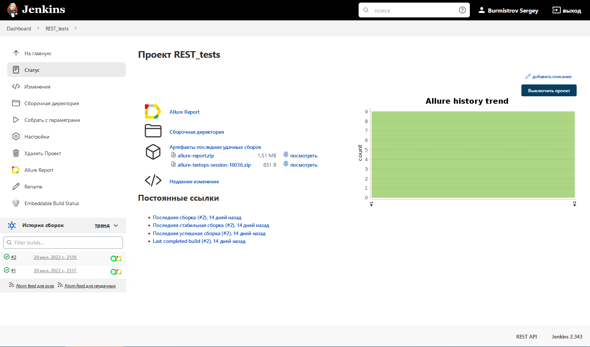
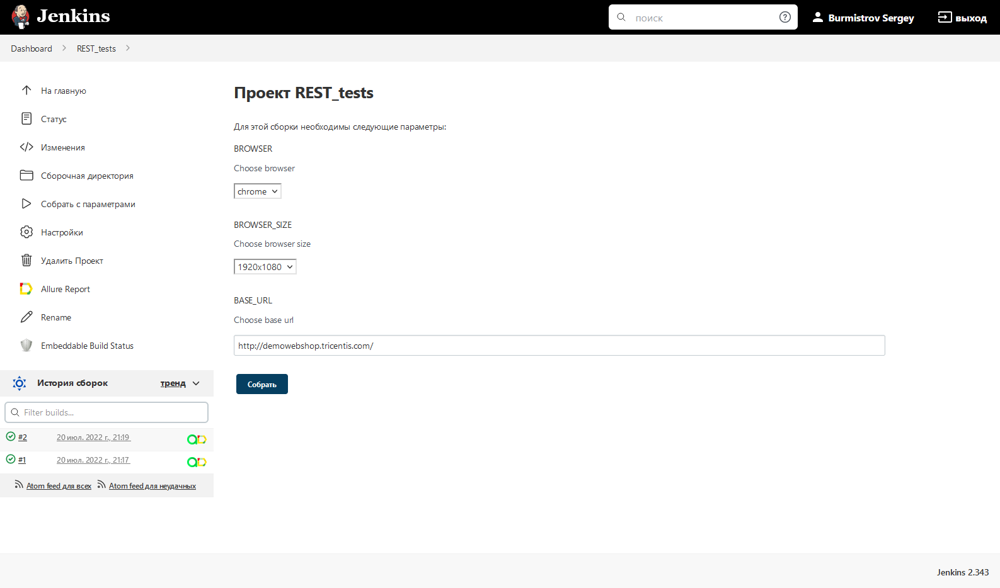
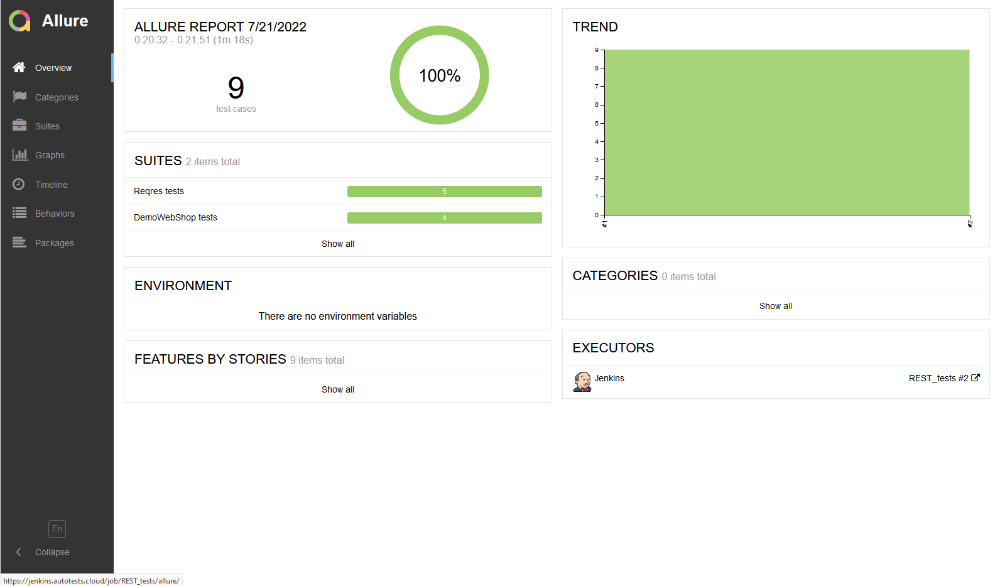
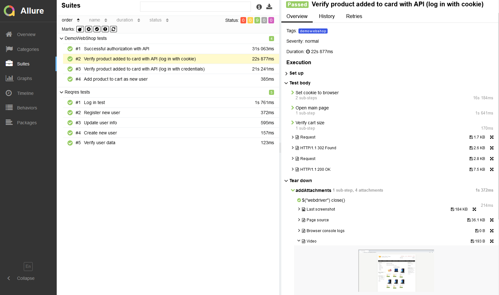
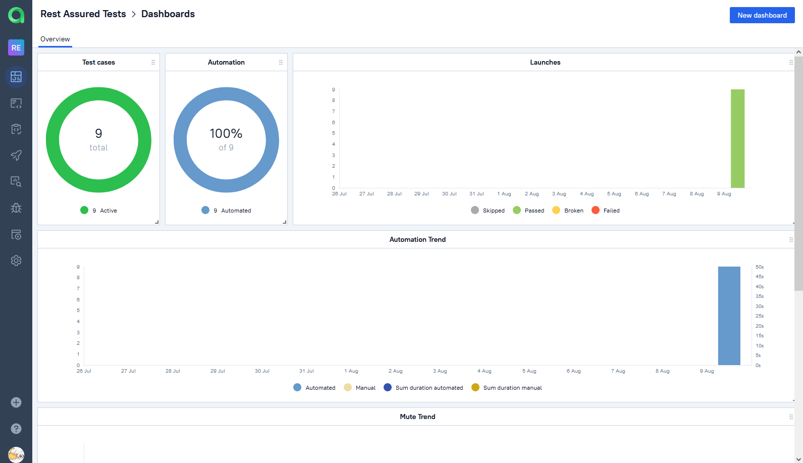
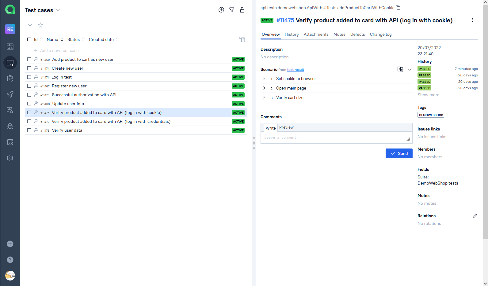
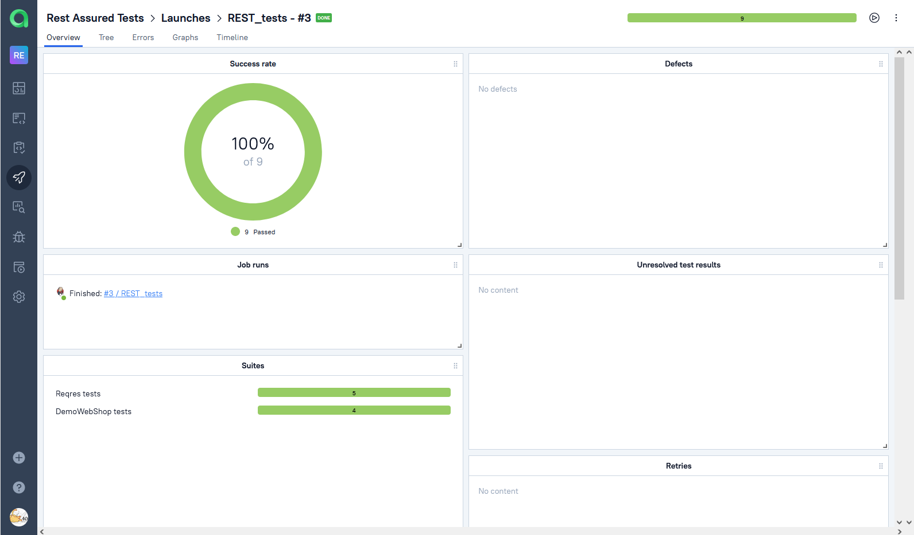
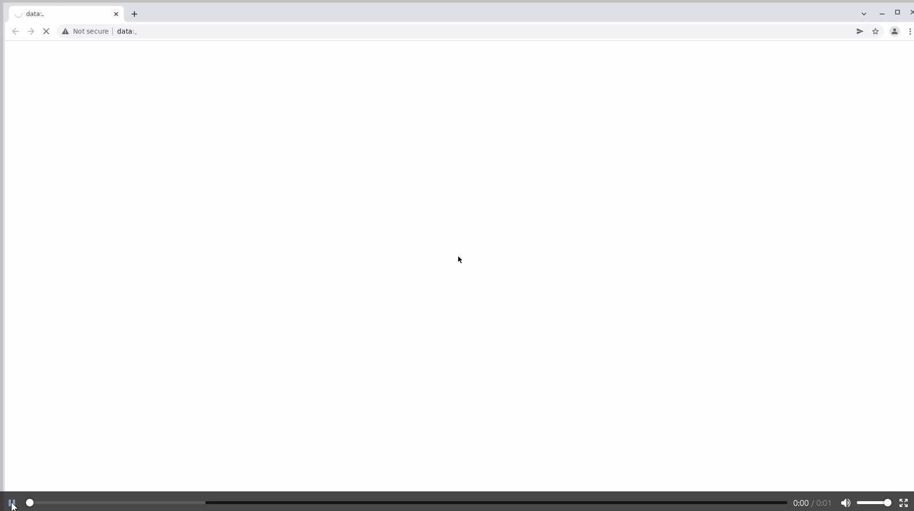

# Automated API tests for [Reqres](http://reqres.in/) and [Demo Web Shop](http://demowebshop.tricentis.com/)

## :page_with_curl: Content

➠ [Technology stack](#TechnologyStack)

➠ [Launch from the terminal](#Terminal)

➠ [Jenkins build](#Jenkins)

➠ [Allure Report integration](#Report)

➠ [Allure TestOps integration](#TestOps)

➠ [Video examples](#Video)

## :computer: <a name="TechnologyStack"></a> Technology stack

<p align="center">


</p>

## :technologist: <a name="Terminal"></a> Launch from the terminal

### Local test run:
```
gradle clean test (to run all tests) 
gradle clean reqres (to run reqres tests only)
gradle clean demowebshop (to run demowebshop tests only)
```

### Run tests on remote selenoid server:
```
gradle clean test -Dconfig=RemoteConfig
```

### Additional build parameters you could use 

>
> <code>-Dbrowser</code> – to change browser, by default it's Chrome. 
>
> <code>-DbrowserVersion</code> – to change browser version, by default it's the last available.
>
> <code>-DbrowserSize</code> – to change browser size, by default it's 1920x1080.
>
> <code>-DbaseUrl</code> – to change base url for the tests, by default it's http://demowebshop.tricentis.com/
>
> <code>-DselenoidUrl</code> – to change selenoid server on which the tests are going to run.

## <a name="Jenkins"></a> Jenkins [build](https://jenkins.autotests.cloud/job/REST_tests/)

<p align="center">
  
</p>

### :robot: Build Options

<p align="center">
  
</p>

## <a name="Report"></a> Allure [Report](https://jenkins.autotests.cloud/job/REST_tests/allure/)

### Overview

<p align="center">

</p>

### Test Suites

<p align="center">

</p>

## <a name="TestOps"></a> Allure [TestOps](https://allure.autotests.cloud/project/678/)

### Dashboards

<p align="center">

</p>

### Test cases

<p align="center">

</p>

### Launch

<p align="center">

</p>


## <a name="Video"></a> :tv: Video attach example
<p align="center">

</p>
